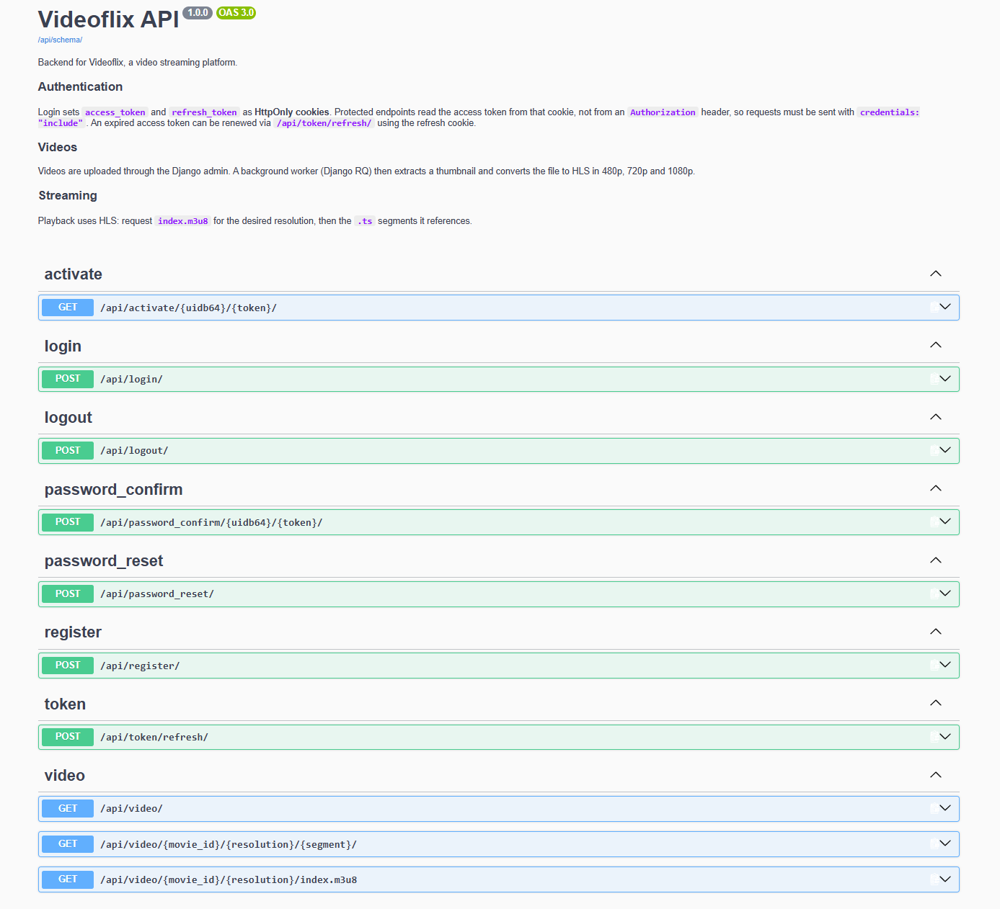

# Videoflix Backend

A RESTful backend for **Videoflix**, a video streaming platform in the style of
Netflix. Users register, confirm their account by email and stream videos via
**HLS** in three resolutions. Uploaded videos are converted in the background
with FFmpeg. The project is built with Django and the Django REST Framework.

Authentication runs entirely on **JWT stored in HttpOnly cookies**, so a
browser client never has to store a token itself. The whole stack runs in
**Docker**: PostgreSQL, Redis and Django with a Gunicorn server and two RQ
workers. The frontend is provided by the Developer Akademie and lives in
[project.Videoflix](https://github.com/Developer-Akademie-Backendkurs/project.Videoflix);
everything behind `/api/` is this project.



---

## Features

- JWT authentication via **HttpOnly cookies** (register, activate, login, logout, refresh)
- Refresh tokens are **blacklisted** on logout and cannot be reused
- **Account activation by email**, accounts stay inactive until the link is used
- **Password reset by email**, without ever revealing whether an address exists
- Responsive **HTML emails** with the logo embedded in the message itself
- Automatic **HLS conversion** to 480p, 720p and 1080p after an upload
- **Thumbnail** extracted from the middle of the video, no manual upload needed
- Conversion and email delivery run in the background with **Django RQ**,
  emails on a `high` and conversions on a `low` priority queue
- **Cleanup on delete**: source file, thumbnail and all HLS files go with it
- Auto-generated **OpenAPI 3 documentation** (Swagger UI & ReDoc) via drf-spectacular

---

## Tech Stack

**Backend**

<p align="left">
  
  
  
  
  
  
  
  
  
  
  
</p>

| Component        | Version                                       |
| ---------------- | --------------------------------------------- |
| Language         | Python 3.12 (`python:3.12-alpine`)            |
| Framework        | Django 6.1                                    |
| API              | Django REST Framework 3.18.0                  |
| Database         | PostgreSQL 18 (`postgres:18`)                 |
| Cache            | Redis via django-redis 7.0.0                  |
| Background tasks | django-rq 4.1.1 (Redis backed)                |
| Auth             | djangorestframework-simplejwt 5.5.1 (cookies) |
| Video processing | FFmpeg (bundled in the image)                 |
| WSGI server      | Gunicorn 26.0.0 with WhiteNoise 6.12.0        |
| API docs         | drf-spectacular 0.30.0 (OpenAPI 3)            |

---

## Project Structure

```text
videoflix_backend/
├── core/                # Project settings, root URL config, WSGI/ASGI
├── auth_app/            # Registration, activation, login, logout, password reset
│   ├── api/             # serializers.py, views.py, urls.py, authentication.py, utils.py
│   ├── templates/       # HTML emails for activation and password reset
│   ├── utils.py         # Token and link building, email delivery
│   └── signals.py       # Queues the activation email on registration
├── video_app/           # Video model, listing and HLS delivery
│   ├── api/             # serializers.py, views.py, urls.py
│   ├── utils.py         # FFmpeg calls, path helpers, conversion pipeline
│   └── signals.py       # Queues the conversion, cleans up on delete
├── docker-compose.yml
├── backend.Dockerfile
├── backend.entrypoint.sh
└── requirements.txt
```

---

## Getting Started

### Prerequisites

- **Docker** and **Git**, nothing else. Docker Desktop under Windows and
  macOS, Docker Engine with the Compose plugin under Linux. Python,
  PostgreSQL, Redis and FFmpeg all live inside the containers.

> ⚠️ **Give Docker enough memory.** Converting to 1080p with x264 needs well over
> 1.5 GB of RAM. On Windows with the WSL 2 backend, Docker Desktop has no
> memory slider, the limit comes from `%USERPROFILE%\.wslconfig`:
>
> ```ini
> [wsl2]
> memory=8GB
> swap=2GB
> ```
>
> Apply it with `wsl --shutdown`, then restart Docker Desktop. With too little
> memory the conversion job is killed by the system and the video ends up with
> the status `failed`, without an obvious reason in the logs.

### Installation

1. **Clone the repository**

   ```bash
   git clone https://github.com/B-Blarr/Videoflix-Backend.git
   cd Videoflix-Backend
   ```

2. **Set up your environment file.** Copy the provided template, then fill in
   your own values. The `.env` file itself is git-ignored.

   Windows (PowerShell):

   ```powershell
   Copy-Item .env.template .env
   ```

   macOS / Linux:

   ```bash
   cp .env.template .env
   ```

   | Variable                   | Description                                             |
   | -------------------------- | ------------------------------------------------------- |
   | `SECRET_KEY`               | Django secret key, required                             |
   | `DJANGO_SUPERUSER_*`       | Admin account created on the first start                |
   | `DEBUG`                    | Present in the template, but not read by the project    |
   | `DB_*`                     | PostgreSQL name, user, password, host and port          |
   | `REDIS_LOCATION`           | Connection URL used by the cache                        |
   | `REDIS_HOST`, `REDIS_PORT` | Connection used by the RQ queues                        |
   | `REDIS_DB`                 | Redis database index used by the RQ queues              |
   | `EMAIL_HOST`, `EMAIL_PORT` | SMTP server used to send mail                           |
   | `EMAIL_HOST_USER`          | SMTP user                                               |
   | `EMAIL_HOST_PASSWORD`      | SMTP password                                           |
   | `EMAIL_USE_TLS`, `_USE_SSL`| Transport encryption, `True` or `False`                 |
   | `DEFAULT_FROM_EMAIL`       | Sender address of all outgoing mail                     |
   | `ALLOWED_HOSTS`            | Comma-separated hostnames                               |
   | `CSRF_TRUSTED_ORIGINS`     | Comma-separated frontend origins                        |

   The template already ships a working key. To generate your own without
   installing anything:

   ```bash
   docker run --rm python:3.12-alpine python -c "import secrets; print(secrets.token_urlsafe(50))"
   ```

   Four more settings are read from the environment but are not part of the
   template, because their defaults already work. Add them to your `.env` if
   you need to change them:

   | Variable                 | Default                                       | Purpose                               |
   | ------------------------ | --------------------------------------------- | ------------------------------------- |
   | `FRONTEND_URL`           | `http://127.0.0.1:5500`                       | Base URL used in the email links      |
   | `COOKIE_SECURE`          | `False`                                       | Set to `True` when serving over HTTPS |
   | `EMAIL_BACKEND`          | `django.core.mail.backends.smtp.EmailBackend` | Backend used to deliver mail          |
   | `CORS_ALLOWED_ORIGINS`   | `http://localhost:5500,http://127.0.0.1:5500` | Origins allowed to send credentials   |

   > ⚠️ **Fill in real mail credentials.** The template ships `EMAIL_HOST` as
   > `smtp.example.com`, a placeholder. Mail goes out through a background
   > worker, so registration still answers `201` while nothing ever arrives,
   > the new account stays inactive and cannot log in. Verify your settings
   > before you register the first user:
   >
   > ```bash
   > docker compose exec web python manage.py sendtestemail you@example.com
   > ```
   >
   > You do not need mail to look around: the superuser from your `.env` is
   > created active on the first start and can log in right away.

3. **Start the stack**

   ```bash
   docker compose up --build
   ```

   The first start builds the image, waits for PostgreSQL, applies all
   migrations, creates the superuser from your `.env` and launches Gunicorn
   together with two RQ workers.

   The API is now available under `http://127.0.0.1:8000/api/`. The root URL
   itself has no view and answers with `404`, that is expected. Good places to
   start are the admin at `/admin/` and the API documentation at
   `/api/schema/swagger-ui/`.

4. **Follow the logs.** In a second terminal, this is where the conversion
   progress and any failing background job show up:

   ```bash
   docker compose logs -f web
   ```

Useful commands while the stack is running:

```bash
docker compose exec web python manage.py createsuperuser
docker compose exec web python manage.py makemigrations
docker compose exec web python manage.py migrate
docker compose exec web sh
```

Stopping and resetting:

```bash
docker compose down        # stop, keep database and media
docker compose down -v     # stop and delete all data, for a clean start
```

> Changes to Python files take effect immediately in the web process, because
> Gunicorn reloads them. **The two RQ workers do not reload.** They load their
> code once at startup, so changes to `video_app/utils.py` or
> `auth_app/utils.py` only apply after `docker compose restart web`. Changes to `requirements.txt` need
> `docker compose up --build`.

---

## Adding Videos

Videos are not uploaded through the API; there is no endpoint for it. They are
added in the Django admin at `http://127.0.0.1:8000/admin/`, using the email
address and password of your superuser.

Create a video with a title, description, category and the video file itself.
Saving it queues a background job that:

1. extracts a thumbnail from the middle of the video,
2. converts the file to HLS in 480p, 720p and 1080p,
3. sets the status to `done`.

**Replacing the video file of an existing entry queues the job again.** The
replaced source file is deleted and the HLS folder is rebuilt from scratch.
Editing only the title, description or category changes nothing about the
conversion.

All three resolutions are always produced, even when the source is smaller,
because the frontend offers all three for every video.

The status of a video is shown in the admin list. Any failure inside the job
sets the status to `failed` and passes the error on to RQ, so the traceback
shows up in the dashboard at `http://127.0.0.1:8000/django-rq/`. This also
covers a timeout, because RQ raises a regular exception for it. Only a worker
process that is killed from outside leaves a video stuck in `processing`.

Conversion takes roughly 1.6 times the runtime of the video. The timeouts
that stop a stuck FFmpeg are set as `HLS_*_TIMEOUT` in `core/settings.py`.

The converted files do not appear in your project folder. `docker-compose.yml`
mounts a named volume over `media/`, so uploads, thumbnails and HLS segments
live inside Docker. To look at them:

```bash
docker compose exec web ls -R media/
```

---

## Frontend

This repository contains the backend only. The matching frontend is provided
by the Developer Akademie:

```bash
git clone https://github.com/Developer-Akademie-Backendkurs/project.Videoflix.git
```

It is plain HTML, CSS and JavaScript, so any static file server will do. The
simplest way is the **Live Server** extension in VS Code: right-click
`index.html` and choose *Open with Live Server*.

> ⚠️ **Open the frontend at `http://127.0.0.1:5500`, not at
> `http://localhost:5500`.** Browsers treat `localhost` and `127.0.0.1` as two
> different sites. The API lives on `127.0.0.1:8000`, so opening the frontend
> on `localhost` turns the auth cookies into cross-site cookies. The browser
> then keeps them only with `SameSite=None; Secure`, which plain HTTP cannot
> offer, and discards them instead. The login returns `200` and you are still
> not logged in.

The origin the frontend is served from has to be listed in
`CORS_ALLOWED_ORIGINS`. Both `localhost:5500` and `127.0.0.1:5500` are covered
by the default.

---

## Tests

Run the full test suite:

```bash
docker compose exec web python manage.py test
```

Measure test coverage:

```bash
docker compose exec web coverage run --source=auth_app,video_app manage.py test
docker compose exec web coverage report -m
```

No test ever invokes FFmpeg: every `subprocess` call is mocked. No mail leaves
the machine either, because Django swaps the mail backend for an in-memory one
during tests. Where a test needs to observe a queued job, the RQ queues are
switched to synchronous execution with `override_settings`. That is why the suite runs
inside the container, where Redis is reachable.

---

## Authentication

The API uses **JWT stored in HttpOnly cookies**, not the `Authorization`
header. Logging in sets two cookies which the browser sends automatically with
every following request:

| Cookie          | Token lifetime | Purpose                     |
| --------------- | -------------- | --------------------------- |
| `access_token`  | 30 minutes     | Authenticates every request |
| `refresh_token` | 7 days         | Obtains a new access token  |

The times above are the lifetimes of the **tokens**. The cookies themselves are
session cookies and are dropped when the browser is closed.

The activation link and the password reset link carry a signed token as well.
Both are created by Django's `default_token_generator` and expire after
**24 hours**, a period configured through `PASSWORD_RESET_TIMEOUT` in
`core/settings.py`. The reset email spells this period out, so the setting and
the wording in `auth_app/templates/reset_password.html` have to be changed
together.

Because the cookies are `HttpOnly`, JavaScript cannot read them. A frontend
therefore has to send its requests with `credentials: "include"`, and its
origin has to be listed in `CORS_ALLOWED_ORIGINS`.

The login response returns the user's data, not the tokens:

```json
{
  "detail": "Login successful",
  "user": {
    "id": 1,
    "username": "user@example.com"
  }
}
```

On logout the refresh token is added to a blacklist and both cookies are
deleted, so no new access token can be obtained. An access token that was
copied beforehand stays valid until it expires.

> **Note:** You log in with the **email address**. The `username` field in the
> response carries that same address; the API contract defines it this way.

---

## API Documentation

Interactive, auto-generated API documentation is available while the server is
running:

| View       | URL                       |
| ---------- | ------------------------- |
| Swagger UI | `/api/schema/swagger-ui/` |
| ReDoc      | `/api/schema/redoc/`      |
| Raw schema | `/api/schema/`            |

To try out a protected endpoint in Swagger UI, call `POST /api/login/` there
first. The browser stores the returned cookies and sends them with every
following request, so the padlock button needs no token pasted into it.

The RQ dashboard, showing queued, finished and failed background jobs, is at
`/django-rq/`. It requires a staff login, so sign in at `/admin/` first.

---

## API Endpoints

Base path: `/api/`

### Authentication endpoints

| Method | Endpoint                              | Description                             | Auth           |
| ------ | ------------------------------------- | --------------------------------------- | -------------- |
| POST   | `/register/`                          | Create a user, send the activation mail | No             |
| GET    | `/activate/{uidb64}/{token}/`         | Activate the account                    | No             |
| POST   | `/login/`                             | Log in and set the auth cookies         | No             |
| POST   | `/logout/`                            | Log out, blacklist and clear the tokens | Refresh cookie |
| POST   | `/token/refresh/`                     | Renew the access token                  | Refresh cookie |
| POST   | `/password_reset/`                    | Send a password reset link              | No             |
| POST   | `/password_confirm/{uidb64}/{token}/` | Set a new password                      | No             |

### Video endpoints

| Method | Endpoint                                    | Description                     | Auth          |
| ------ | ------------------------------------------- | ------------------------------- | ------------- |
| GET    | `/video/`                                   | Converted videos, newest first  | Authenticated |
| GET    | `/video/{movie_id}/{resolution}/index.m3u8` | HLS playlist of one resolution  | Authenticated |
| GET    | `/video/{movie_id}/{resolution}/{segment}/` | A single HLS segment            | Authenticated |

The segment endpoint answers with and without the trailing slash. FFmpeg writes
relative names such as `seg000.ts` into the playlist, so hls.js requests them
without one; serving both spares a `301` redirect per segment.

**Neither the uploaded source file nor the HLS segments are reachable outside
these endpoints.** The media route in `core/urls.py` serves `media/thumbnails/`
alone, so nothing else can be fetched under `/media/`. Thumbnails stay
public on purpose: the frontend sets `thumbnail_url` as an `img` source, and a
preview image is not worth protecting.

Registering expects three fields:

```json
{
  "email": "user@example.com",
  "password": "securepassword",
  "confirmed_password": "securepassword"
}
```

---

## Conventions & Notes

- **Accounts start out inactive.** Registration creates the user, but logging
  in is refused until the link from the activation email has been used.
- **The email links point at the frontend**, not at this API. The frontend
  reads `uid` and `token` from the query string and calls the backend itself.
  Which addresses are used is controlled by `FRONTEND_URL`.
- **Password reset never reveals whether an address exists.** Both a known and
  an unknown address return the same `200` and the same message; a mail is only
  sent in the first case.
- **Registration never reveals whether an address is already taken.** That
  case returns a deliberately vague message, while password rules are
  reported in plain words so the user can fix them.
- **Conversion runs in the background.** The upload returns immediately, the
  HLS files appear a few minutes later. Requesting a playlist before it is
  ready returns `404`, which is the documented behaviour.
- **Queues are prioritised.** Emails go to `high`, video conversion to `low`.
  Both workers check `high` first, so a mail is picked up ahead of a queued
  conversion as soon as one of the two workers is free.
- **The video list is a flat array**, deliberately not paginated, ordered by
  `created_at` descending. The frontend uses the first entry as its hero video.
- **`thumbnail_url` is an absolute URL**, built from the incoming request, so
  the frontend can use it directly as an image source. It is never `null`,
  because the list only contains videos whose conversion has finished.
- **The `secure` cookie flag follows `COOKIE_SECURE`, not `DEBUG`.** This
  project is served over plain HTTP even when it runs in Docker.
